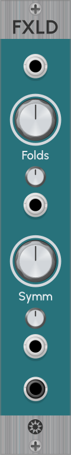
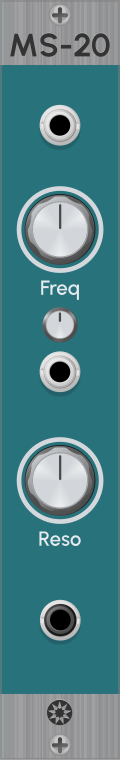

# Agave User Manual

  - [FXLD](#fxld)
  - [METAL](#metal)
  - [LPF Bank](#lpf-bank)
  - [MS-20](#ms-20)

## FXLD

This module implements a "wavefolding" operation on the incoming signal. Wavefolding is a operation in which signal values that exceed certain threshold are inverted or folded back (hence the name of the effect). When driven by a signal with low harmonic content (e.g. a sinusoid or triangular oscillator) this module generates complex harmonically-rich waveforms, making it ideal for a West Coast-style patch.

## METAL

This module generates "metallic" or "pitched" noise inspired by the multi-oscillator arrays used in the Roland TR-808 and TR-606 drum machines to synthesize cymbal and hi-hat sounds. A great reference on cymbal synthesis using metallic noise can be found [here](https://web.archive.org/web/20160403120912/http://www.soundonsound.com/sos/Jul02/articles/synthsecrets0702.asp).

## LPF Bank

This module implements a passive RC filter bank ideal for separating wideband signals, such as noise, into sub-bands. Perfect for percussive patches.

## MS-20

This module implements a voltage-controlled lowpass filter modelled after the Korg MS-20. As with the original circuit, the filter exhibits a unique self-oscillation, and saturates nicely at high levels.
